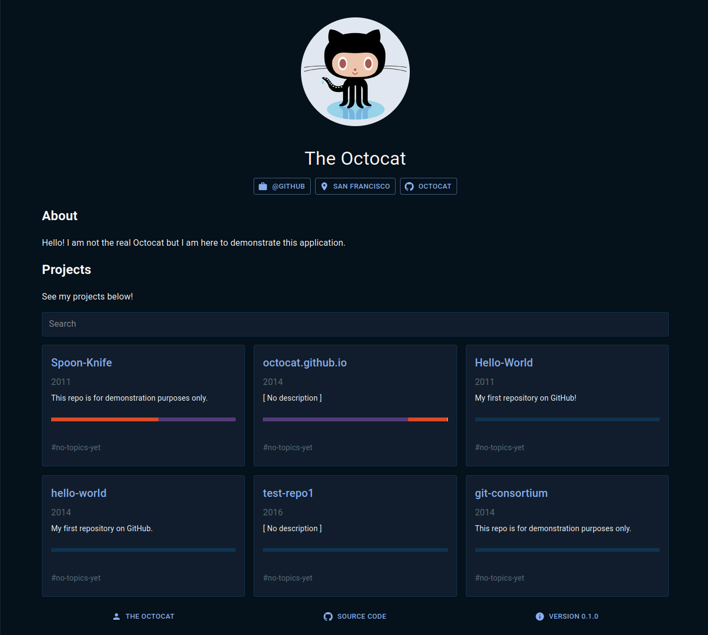

<h1 align="center">:bust_in_silhouette: {you}.github.io</h1>

Show your work!
  

## About

This project offers a quick and easy way for developers to set up and deploy a portfolio website to showcase their work. It uses the GitHub API to automatically fetch up-to-date information from your profile! Simply plug in your GitHub username, write a short bio about yourself and describe your work briefly. Then you can focus on what is important: your work here on GitHub. Please refer to the documentation for more information.

## Demo

Here is what the application looks like with the profile of the [Octocat](https://github.com/octocat). See [rauhala.io](https://rauhala.io) for a real world example.

## Documentation

- [Architecture](docs/architecture.md)
- [Changelog](docs/changelog.md)
- [Code of Conduct](.github/CODE_OF_CONDUCT.md)
- [Contributing](.github/CONTRIBUTING.md)
- [Credits](docs/credits.md)
- [License](LICENSE.md)
- [Security Policy](.github/SECURITY.md)
- [User manual](docs/manual.md)
